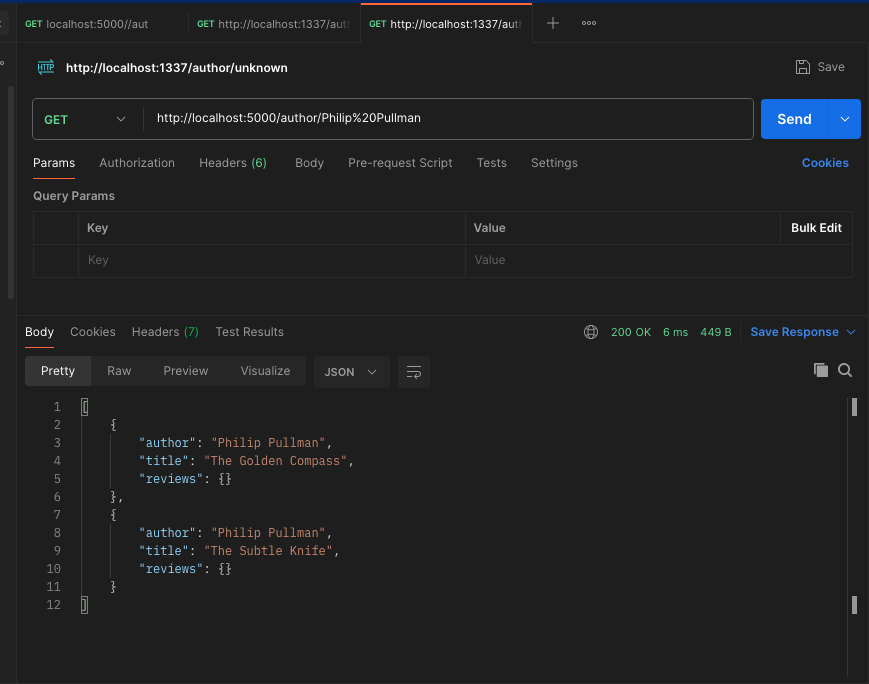

# Online Book Review Application

  <!-- Replace with the path to your project logo -->

## Overview

The Online Book Review Application is a server-side web application developed using Node.js and Express.js. It provides a platform for users to access and manage book ratings and reviews. The application offers various features including retrieving book details, searching books by ISBN, author, or title, registering new users, login authentication, adding, modifying, and deleting book reviews.

This project was developed by Nediou Daniel as a final project for the Node.js & Express.js course.

## Features

- Retrieve a list of all books available in the bookshop
- Search for specific books by ISBN code, author names, and titles
- Retrieve reviews/comments for specified books
- Register as a new user of the application
- Login to the application
- Add a new review for a book (logged-in users only)
- Modify a book review (logged-in users can modify only their own reviews)
- Delete a book review (logged-in users can delete only their own reviews)
- Allow multiple users to access the application simultaneously

## Implementation Details

- **Node.js & Express.js**: Used for server-side development and handling HTTP requests.
- **Promises and Async/Await**: Implemented asynchronous operations to ensure efficient handling of database queries and other asynchronous tasks.
- **JWT Authentication**: Implemented token-based authentication for user login to secure certain operations.
- **Session Management**: Used session management for maintaining user authentication state across requests.
- **RESTful API**: Developed a RESTful web service to communicate with the client-side application.
- **Postman**: Used for testing API endpoints and verifying the functionality of different features.
- **Screenshots**: Included screenshots for various tasks and features to provide visual representation and aid in understanding.

## Usage

1. Clone the repository to your local machine.
2. Install the required dependencies using `npm install`.
3. Start the server using `npm start`.
4. Use Postman or any API testing tool to interact with the endpoints provided by the application.
5. Refer to the documentation and screenshots provided below for detailed instructions on using each feature.

## Screenshots

- Task 1: Get the book list available in the shop
  

<!-- Include other screenshots similarly -->
 
## Author

- **Nediou Daniel**
- **GitHub:** [Your GitHub Profile](https://github.com/nebioudaniel)

